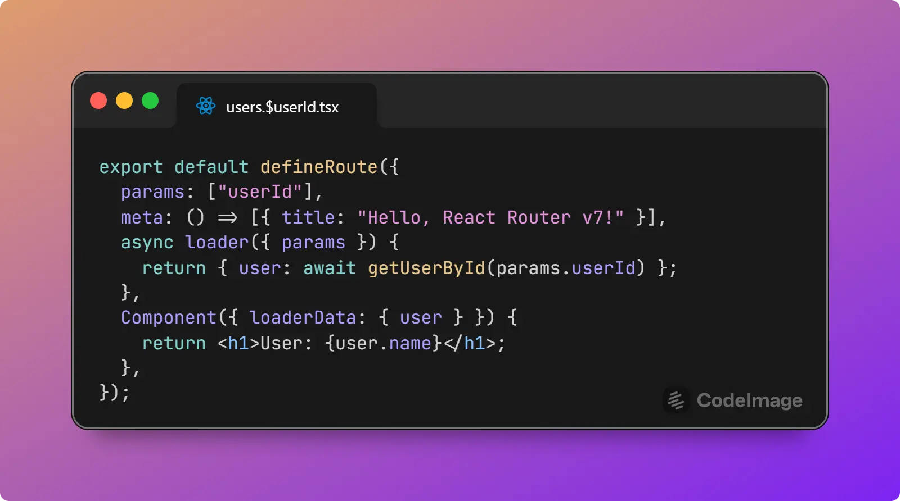

# Codemod for Type-safe Remix/React Router

> More info: https://github.com/orgs/remix-run/projects/5?pane=issue&itemId=62153560

First demo: https://x.com/kuba_jastrz/status/1798783656305025372

**Before:**


**After:**



> This is only a concept image, the actual codemod doesn't fully work like this yet. It's close though 😄

## Usage

I don't know how to package this yet, but you can run it locally:

```bash
git clone https://github.com/KubaJastrz/typesafe-remix-codemod
cd typesafe-remix-codemod
cargo run ./remix-app  # or path to any other remix app
```

## How it works

The codemod finds all route files with `npx -y @remix-run/dev routes --json` and iterates over them with [oxc_parser](https://oxc.rs/docs/guide/usage/parser.html).

It makes transformations in two passes per file. The first one is to modify the existing function bodies and remove the `useLoaderData`/`useActionData` hook calls. The second pass is to replace all Remix exports with the new `defineRoute` default export.

## Contributing

```bash
# run against local remix app
cargo run ./remix-app

# revert codemod changes
git restore ./remix-app

# test
cargo test

# review snapshots
cargo insta review
```

### Todo

Progress is being tracked in [Issue #2](https://github.com/KubaJastrz/typesafe-remix-codemod/issues/2).
